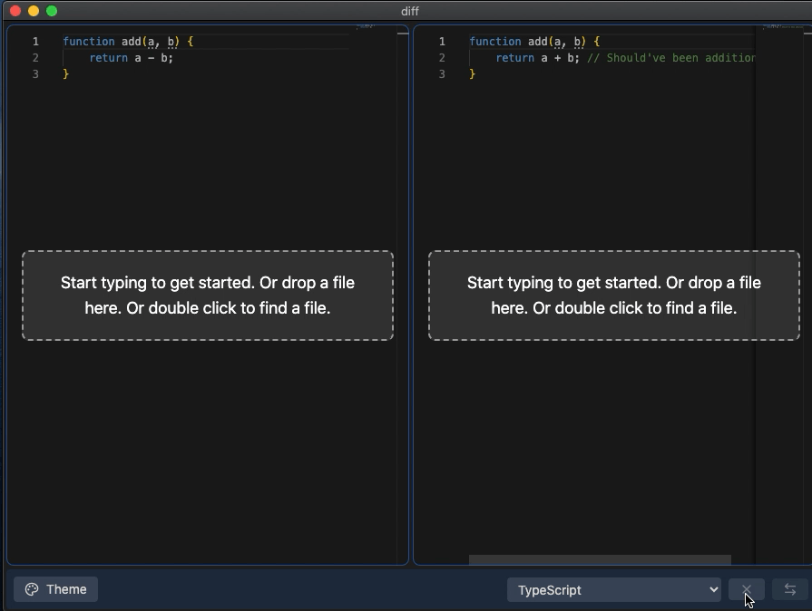

# diff

A simple, privacy-focused text comparison app.


## Demo



## How do I get it?

Automated releases are coming soon! (I'm a one man operation lol)
In the meantime, you'll need to build it yourself. See below.

## Why?

Text comparison is an essential part of my workflow (especially as a dev and even more so, with AI as part of code workflows). I love the experience of using VS Code's built-in diff editor and I love online tools like [Text Compare](https://text-compare.com/), but VS Code tends to be a bit heavy for quick comparisons, and online tools can raise privacy concerns, since you sent your data to their servers.

I wanted a tool that combined the best of both worlds: the speed and reliability of a local application with the modern features of VS Code's diff editor, without compromising on privacy.

So I build one myself.

## Features

- **VS Code-like Experience:** Built on [Monaco Editor](https://microsoft.github.io/monaco-editor/), offering the same robust diffing algorithm, syntax highlighting, and keybindings you love in VS Code.
- **Privacy First:** Runs entirely locally. No data is sent to the cloud.
- **Smart Language Detection:** Automatically detects file languages using a high-performance Rust backend (via `napi-rs`) to ensure accurate syntax highlighting.
- **Drag & Drop:** Simply drag files into the editor to compare them.

## Tech Stack & Architecture

This project is built with **Electron**, **React**, **Vite**, and **Rust**.

- **Frontend:** React 18 + TypeScript
- **Build Tool:** Vite
- **Desktop Framework:** Electron (Chromium + Node.js)
- **Native Module:** Rust (compiled via `napi-rs`) for language detection

### Why Electron? Why not xyz?

I initially started this project with **Tauri** to keep the app small & lightweight. However, I encountered compatibility issues with older macOS versions (specifically macOS Catalina, which I use) and the system webview's support for modern ESNext features required by the latest Monaco Editor.

To ensure a consistent, high-quality experience across all supported platforms without compromising on editor features, I migrated to Electron. While this increases the app size, it guarantees that the rendering engine is modern and consistent.

To mitigate performance concerns, the heavy lifting for language detection is kept in **Rust**, exposed to Node.js via `napi-rs`. This hybrid approach gives us the best of both worlds: a stable, highly compatible UI and with near instant native processing.

## Getting Started

### Prerequisites

- [Node.js](https://nodejs.org/) (v18 or higher)
- [Rust](https://www.rust-lang.org/tools/install) (for building the native language detection module)

### Installation

1. Clone the repository:
   ```bash
   git clone https://github.com/lkekana/diff.git
   cd diff
   ```

2. Install dependencies:
   ```bash
   npm install
   ```

3. Build the Rust native module:
   ```bash
   cd rust/language-detection
   pnpm build
   cd ../..
   ```

4. Run the development server:
   ```bash
   npm run dev
   ```

### Building for Production

To create a distributable package:

```bash
npm run build
```

This will compile the TypeScript/React code, bundle the Electron main/preload scripts, and package the application using `electron-builder`.

## The Journey

The project while simple in concept, ending up being a deep dive into the modern desktop development ecosystem.

- **From Tauri to Electron:** Learning the trade-offs between system webviews and bundled Chromium.
- **Monaco Integration:** Bridging the gap between modern React/Vite setups and the complex worker-based architecture of Monaco Editor.
- **Rust & NAPI-RS:** Writing high-performance native modules and safely exposing them to JavaScript.
- **Debugging WebViews:** Mastering the art of debugging JavaScript inside Electron's renderer process.
- **Drag & Drop APIs in Electron:** It even spawned a sub-project for a reusable drag & drop file uploader component! See [dropzone](https://github.com/lkekana/dropzone) on [npm](https://www.npmjs.com/package/@lkekana/dropzone)

I probably could've built this really quickly with an AI agent, but I happen to enjoy building & learning, more than I do shipping quickly. Building this the hard way gave me a much deeper understanding of the technologies involved, forced me to familiarise myself with Rust and gave me the experience of making a modern desktop app from scratch.

These lessons should carry me further than if I hadn't.

## Roadmap

- [ ] **Automated Releases:** Setting up GitHub Actions for cross-platform builds (macOS, Windows) including native Rust binaries.
- [ ] **Web Version:** Porting the core logic to a pure web application (WASM for language detection) for instant access without installation.
- [ ] **Performance Optimisations:** Further tuning the Rust detection algorithms.

## License

MIT © Lesedi Kekana